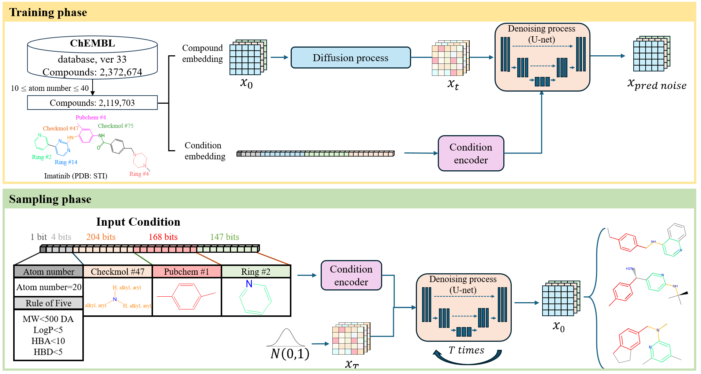
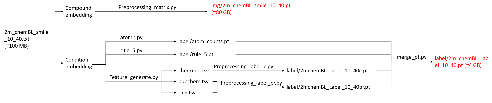
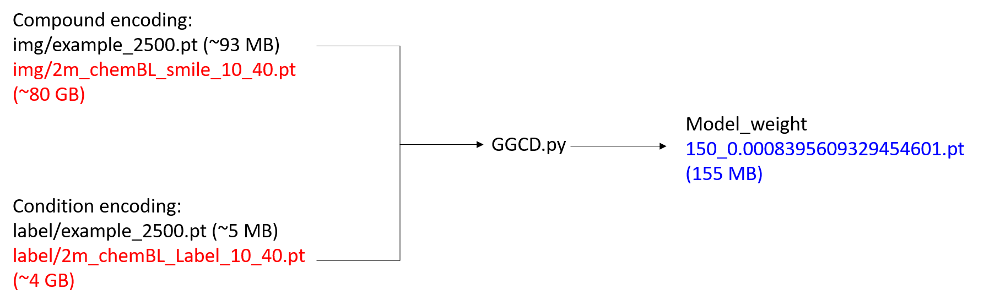
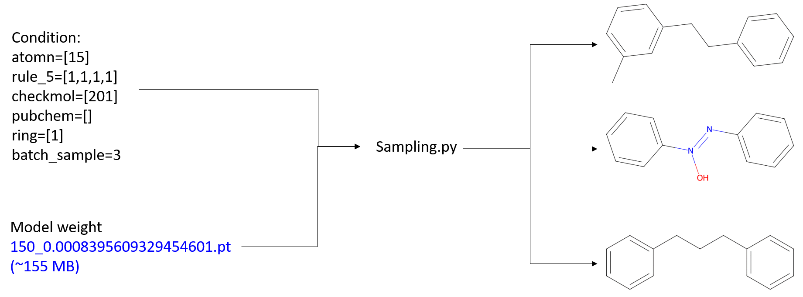

## GCMDiff
This repository contains the official implementation of GCMDiff, a condition-guided diffusion model designed for targeted molecular design and fragment-based drug discovery.


**Overview of GCMDiff.**

This repository hosts the source code used for the data processing within our study, alongside all relevant raw data. For comprehensive details regarding the methodology, please refer to
> GCMDiff: a condition-guided diffusion framework for fragment-based drug discovery and target-specific molecular design
>
> Ya-Ko Wei†, Jung-Yu Lee†, Jhih-Wei Chu, Jinn-Moon Yang*


## Project Structure
```
├── GCMDiff_training/          # Training module
│   ├── dataset/               # Processed images and label features
│   ├── denoising_diffusion/   # Model architecture and saved weights
│   ├── preprocess/            # Data preprocessing scripts
│   └── GGCD.py                # Main training script
└── GCMDiff_sampling/          # Sampling/Generation module
    ├── denoising_diffusion/   # Pre-trained weights and model code
    ├── utils/                 # Utility functions (Moiety input, MOL file conversion)
    ├── output/                # Generated PNG and MOL files
    └── Sampling.py            # Main generation script
```

## Requirements
CompoundGPT currently supports Python > 3.10

- [joblib](https://pypi.python.org/pypi/joblib)
- [NumPy](https://numpy.org/)
- [pandas](http://pandas.pydata.org/)
- [scikit-learn](https://scikit-learn.org/stable/)
- [rdkit](https://www.rdkit.org/)
- [pytorch](https://pytorch.org/) > 2.0.0

## Getting Started
### Preprocessing

The pipeline starts from a SMILES list (e.g., ./GCMDiff_training/preprocess/2m_chemBL_smile_10_40.txt) and encodes it into two components:
1. Compound Encoding: SMILES strings are converted into matrix images (img/) using Preprocessing_matrix.py. _(Note: Full processed datasets are omitted due to file size constraints.)_
2. Condition Encoding: Molecular features (Atom count, Lipinski's Rule of Five, specific moieties, etc.) are extracted into labels (label/) and merged via merge_pt.py. _(Note: Full processed datasets are omitted due to file size constraints.)_


### Training

The training process (GGCD.py) leverages both compound and condition encodings to optimize the diffusion model. Our implementation is based on [Denoising diffusion probabilistic models](https://dl.acm.org/doi/pdf/10.5555/3495724.3496298) and has been modified to support conditional guidance.   
_Note: Since the full training set (>2M compounds) is too large for hosting, a subset of 2,500 compounds is provided as an example._

Input: Matrix images (e.g., ./GCMDiff_training/dataset/img/example_img_2500.pt) and merged label features (e.g., ./GCMDiff_training/dataset/label/example_label_2500.pt).

Output: Model weights saved in ./GCMDiff_training/denoising_diffusion/model_weight/ (e.g., [GCMDiff_model_weight](https://hisbim.life.nctu.edu.tw/Compound_moiety/150_0.0008395609329454601.pt))


**Example Run:**
```bash
CUDA_VISIBLE_DEVICES=1 python3 GGCD.py
```

### Sampling (Molecular Generation)

Users can generate novel molecules by providing specific conditions in Sampling.py.  

Pre-trained Weights:
Please download the pre-trained weights from [here](https://hisbim.life.nctu.edu.tw/Compound_moiety/150_0.0008395609329454601.pt) and place the file in: ./GCMDiff_sampling/denoising_diffusion/model_weight/.


Configurable Parameters:
1. atomn: Targeted number of atoms (e.g., [15]).
2. rule_5: Compliance with Lipinski’s Rule of Five (e.g., [1,1,1,1]).
3. checkmol: 204 specific moiety codes from Checkmol (e.g., [201] for aromatic compound). 
4. pubchem: 168 specific moiety codes from PubChem. 
5. ring: 147 specific moiety codes from Rings in Drugs (e.g., [1] for benzene). 
6. batch_sample: Number of output compounds (e.g., 3 compounds).

[519 Moiety Reference List](https://hisbim.life.nctu.edu.tw/Compound_moiety/functional_groups.php)


**Example Run:**
```bash
CUDA_VISIBLE_DEVICES=1 python3 Sampling.py
```

## Contact Information
All technical questions pertaining to the GCMDiff datasets and associated scripts should be directed to [BioXGEM](https://bioxgem.life.nctu.edu.tw/bioxgem/).

We appreciate your interest in our published work.
